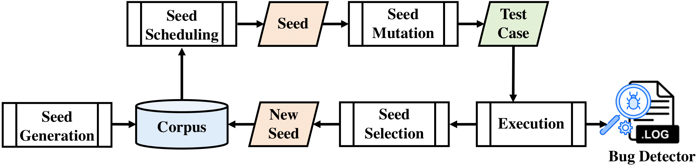

# Are We There Yet? Unraveling the State-of-the-ArtSmart Contract Fuzzers (Experience Paper)
<p align="center"></p>


# Artifacts
Due to the size limit of 2GB imposed by Git LFS, all the dockerfiles and benchmarks used in our experiment are available for access at:
https://terabox.com/s/1NcZk3SUi6uEWjnZRo7Qw9A

Get started
===========
### How to load each Dockerfile:

1 import the docker image
```
docker import xxxxxDemo.tar testimage
```
2. start docker image
```
docker run -idt -p 5180:80 testimage:latest /bin/bash
```
3. run docker image
```
docker exec -it container_ID_obatined_in_step_2  /bin/bash
```

Please note that, due to the size of files, for some docker file, we upload a compressed one, please unzip it before you check. 

### Subsection compression

zip b.zip b.z01 b.z02... -s=0 --out sum.zip

After that, use the unzip command to unzip


Usage
=====

## ContractFuzzer
```
docker run ......
cd /ContractFuzzer
bash run.sh --contracts_dir contract_folder
```
The covered instructions can be found at file: /tracelog.log


## ILF
```
cd /go/src/ilf
bash ilfTestDepth.sh
```
The log file can be found at /go/src/ilf/log/


## ConFuzzius
```
cd /root
python3 test.py
or python3 test_depth.py
```
the output result can be found at ./log/


## sFuzz
```
cd /workdir
bash mainShell.sh
```
the output result can be found at ./output/


## xFuzz
```
cd /workdir
bash main.sh
```
the output result can be found at ./output/


## RLF
```
docker run ......
cd /go/src/rlf/
bash ilfTest.sh
```
the output result can be found at ./log/

## Smartian
```
cd /Smartian
bash mainshelldepth2.sh
```
the output result can be found at ./test/


## SmartGift
```
cd /SmartGift/code
python3 SmartGift_main.py target_abi_path sample_path output_path
cd /SmartGift/ContractFuzzer/
bash run.sh --contracts_dir contract_folder output_path
```
https://github.com/chaoweilanmaohahaha/SmartGift

## EthPloit
```
cd /contract-fuzzer/src
bash maindepth2.sh
```
the output result can be found at ./output/


https://github.com/zqzqz/contract-fuzzer


------------------------------------
### SmartACE (not used in our experiment)
```
cd /smartace
solc crowdsale.sol --bundle=Crowdsale --concrete --reps=5 --c-model \
    --output-dir=fuzz

cd fuzz ; mkdir build ; cd build
CC=clang-10 CXX=clang++-10 cmake ..
cmake --build . --target fuzz
```
https://github.com/contract-ace/smartace/blob/cmodel-dev/tutorials/2_getting_started.md


License
=======
Sourcerer is under the MIT license. See the [LICENSE](https://github.com/bbboxA/SCFuzzers/blob/main/LICENSE.md) for more information.


